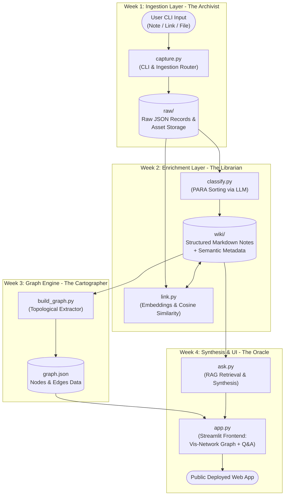
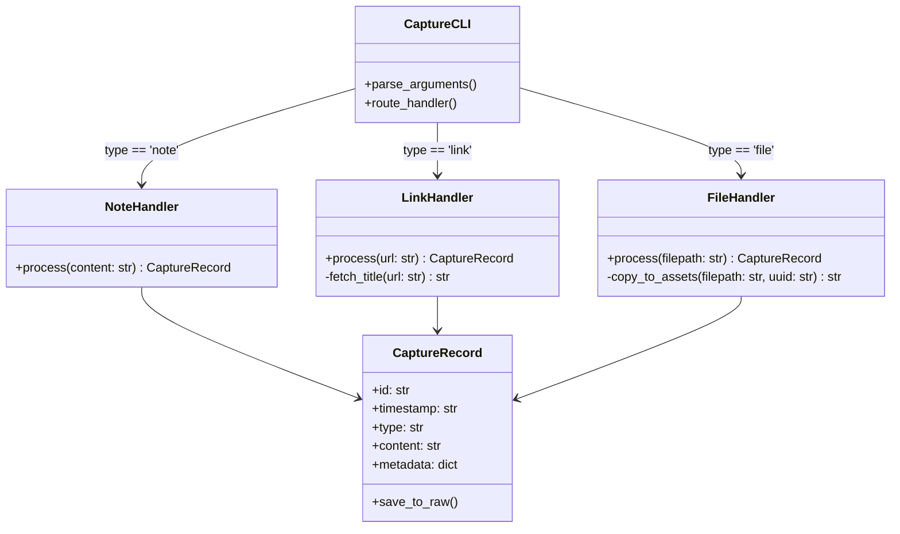

# SecondSelf: System Architecture & Technical Specification

## 1. Architectural Overview & Design Principles

**SecondSelf** is a local-first, modular, AI-powered personal knowledge base ("digital brain") designed to capture scattered digital inputs, autonomously classify and interlink them using LLMs and vector embeddings, visualize the resulting knowledge graph, and serve as a Retrieval-Augmented Generation (RAG) oracle over your personal data.

### Core Architectural Principles
1. **Local-First & Immutable Raw Storage**: All ingested information lands in an immutable ingestion layer (`raw/`). The original capture is never modified, ensuring zero data loss (`"Capture Everything, Lose Nothing"`).
2. **Separation of Concerns (Ingestion vs. Enrichment vs. Presentation)**:
   - **Ingestion (`Week 1: capture.py`)**: Fast, offline-capable CLI capture.
   - **Enrichment (`Week 2: classify.py, link.py`)**: Asynchronous, idempotent transformations that process `raw/` records into organized `wiki/` notes and vector indices.
   - **Graph Construction (`Week 3: build_graph.py`)**: Read-only compilation of structured notes into topological node-edge structures.
   - **Query & Presentation (`Week 4: ask.py, app.py`)**: RAG synthesis layer and unified interactive web frontend.
3. **Idempotency & Pipeline Replayability**: Each stage reads from the previous directory/file and produces deterministic outputs. If the `wiki/` or `graph.json` is deleted, it can be entirely reconstructed from the immutable `raw/` logs.

---

## 2. System Architecture & Data Flow Diagram



---

## 3. End-to-End Data Pipeline Specification

### Stage 1: Ingestion & Archiving (Week 1 Focus)
- **Input Types**:
  1. **Note**: Plain text strings, markdown snippets, ideas, or quick thoughts.
  2. **Link**: Web URLs (HTTP/HTTPS). The system preserves the URL and optionally extracts basic page title/description metadata.
  3. **File**: Local file paths (PDFs, Markdown, text documents, images). The file is copied to a standardized `raw/assets/` directory to prevent broken references if the original file is moved or deleted.
- **Output Record Format**: Every single capture generates a discrete, atomic JSON file in `raw/` named by its unique ID (`<uuid>.json`).

### Stage 2: Autonomous Organization & Semantic Linking (Week 2)
- **PARA Classification (`classify.py`)**: Reads unprocessed `raw/*.json` files and queries an LLM (e.g., Groq / Llama-3-70B or local Ollama) using structured JSON prompting. Assigns:
  - **PARA Category**: `Projects`, `Areas`, `Resources`, or `Archives`.
  - **Tags**: 3-5 high-signal descriptive keywords.
  - **Summary**: A concise 1-2 sentence distillation of the content.
- **Semantic Linker (`link.py`)**:
  - Uses local embeddings (`sentence-transformers/all-MiniLM-L6-v2`) to generate 384-dimensional dense vectors for each note's summary/content.
  - Computes pairwise Cosine Similarity against all existing notes in `wiki/`.
  - When similarity $\ge \theta$ (e.g., $0.65$), bidirectional markdown/JSON links are automatically established (`[[Note ID]]`).

### Stage 3: Graph Construction (Week 3)
- **Graph Extraction (`build_graph.py`)**:
  - Iterates through `wiki/` notes and compiles a unified `graph.json` structure containing:
    - `nodes`: `[{ "id": "uuid", "label": "Title/Summary", "group": "PARA_Category", "content": "..." }]`
    - `edges`: `[{ "from": "uuid_A", "to": "uuid_B", "weight": 0.78 }]`

### Stage 4: Retrieval-Augmented Synthesis & Frontend (Week 4)
- **RAG Engine (`ask.py`)**:
  - Encodes the user's plain English query using the same embedding model.
  - Performs Top-$K$ semantic search across `wiki/` vectors.
  - Constructs a grounded prompt injecting retrieved contexts into the LLM context window to generate accurate, citation-backed answers.
- **Unified UI (`app.py`)**: Streamlit interface embedding a JavaScript Vis-Network graph canvas alongside the interactive Q&A search bar.

---

## 4. Week 1 Technical Architecture & Detailed Specification

### 4.1 CLI Architecture (`capture.py`)
The `capture.py` script serves as the sole entry point for the Archival layer. It utilizes Python's standard `argparse` module (or `click`) to provide a frictionless CLI experience.



### 4.2 Storage Schema Specification (`raw/<uuid>.json`)
Every captured item is stored as an independent JSON record inside `raw/`. This guarantees atomic write operations and eliminates locking issues during concurrent or bulk captures.

#### JSON Schema Definition:
```json
{
  "$schema": "http://json-schema.org/draft-07/schema#",
  "title": "RawCaptureRecord",
  "type": "object",
  "properties": {
    "id": {
      "type": "string",
      "format": "uuid",
      "description": "Unique UUIDv4 identifier for the capture."
    },
    "timestamp": {
      "type": "string",
      "format": "date-time",
      "description": "ISO 8601 UTC timestamp (e.g., '2026-07-12T08:30:00Z')."
    },
    "type": {
      "type": "string",
      "enum": ["note", "link", "file"],
      "description": "The modality of the capture."
    },
    "content": {
      "type": "string",
      "description": "Raw text string, target URL, or local file description/content."
    },
    "metadata": {
      "type": "object",
      "properties": {
        "original_path": { "type": ["string", "null"] },
        "asset_path": { "type": ["string", "null"] },
        "url_title": { "type": ["string", "null"] },
        "file_size_bytes": { "type": ["integer", "null"] },
        "file_extension": { "type": ["string", "null"] }
      }
    },
    "status": {
      "type": "string",
      "enum": ["raw", "processed", "error"],
      "default": "raw",
      "description": "Tracking state for downstream Week 2 processing."
    }
  },
  "required": ["id", "timestamp", "type", "content", "status"]
}
```

### 4.3 Directory Structure & Asset Management
```
secondself/
├── raw/
│   ├── assets/                 # Copied local files (PDFs, images, docs)
│   │   └── f81d4fae-7dec-11d0-a765-00a0c91e6bf6.pdf
│   ├── 3f0e81b2-11c3-4d40-8b1a-98126b8e21a0.json   # Note capture
│   ├── 7c9e6679-7425-40de-944b-e07fc1f90ae7.json   # Link capture
│   └── f81d4fae-7dec-11d0-a765-00a0c91e6bf6.json   # File capture record
├── wiki/                       # Target directory for Week 2 processed records
├── capture.py                  # Core CLI capture script
├── requirements.txt            # Project dependencies
└── README.md                   # System documentation
```

---

## 5. Technology & Dependency Stack

| Layer | Recommended Library / Tool | Rationale |
| :--- | :--- | :--- |
| **CLI & Parsing** | `argparse` (Standard Library) or `click` | Zero dependency overhead for basic usage; robust argument validation. |
| **Unique IDs & Time** | `uuid`, `datetime` (Standard Library) | Guaranteed uniqueness (`UUIDv4`) and standardized `ISO 8601` timezone handling. |
| **Web & Link Metadata** | `requests`, `beautifulsoup4` | Fast, lightweight extraction of `<title>` and `<meta name="description">` from links. |
| **LLM Classification (W2)** | `groq` or `openai` Python SDK | Low-latency inference for fast PARA classification (`Llama-3-70B` via Groq). |
| **Vector Embeddings (W2)**| `sentence-transformers`, `numpy` | Local, free, privacy-preserving embedding computation (`all-MiniLM-L6-v2`). |
| **Graph Visualization (W3)**| `vis-network` (JS) / `pyvis` | Interactive HTML5 canvas graph rendering with force-directed physics. |
| **Web UI & Deployment (W4)**| `streamlit` | Rapid development of reactive web apps combining custom HTML/JS graphs and chat UX. |

---

## 6. Error Handling, Edge Cases & Resilience (Week 1)

1. **Frictionless Offline Operation**:
   - If a user captures a `--link` while offline or if the URL fails to resolve during title extraction, `capture.py` **must not fail**. It logs the raw URL, sets `url_title: null`, saves the JSON record, and exits cleanly.
2. **File Handling & Deduplication**:
   - When `--file` is passed, the script checks if the file exists locally. If valid, it copies the file to `raw/assets/<uuid>_<original_filename>` to ensure that subsequent moves/deletions of the source file do not corrupt the brain's archive.
3. **Encoding Protection**:
   - All text file reads and JSON writes enforce `utf-8` encoding with explicit error handlers (`errors='replace'`) to prevent crashes when encountering emojis, special symbols, or non-ASCII characters.

---

## 7. Week 1 Implementation Checklist & Verification Plan

### Phase 1: Workspace & Directory Initialization
- [ ] Create core folders: `raw/`, `raw/assets/`, and `wiki/`.
- [ ] Create `requirements.txt` containing necessary utilities (`requests`, `beautifulsoup4`).

### Phase 2: Core Capture Script (`capture.py`)
- [ ] Implement CLI argument parser with `--note`, `--link`, and `--file` flags (mutually exclusive or intelligently routed).
- [ ] Implement `NoteHandler` taking plain text strings and generating atomic JSON records.
- [ ] Implement `LinkHandler` taking URLs, performing optional lightweight title scraping, and generating atomic JSON records.
- [ ] Implement `FileHandler` validating local file existence, copying to `raw/assets/`, and generating atomic JSON records.
- [ ] Ensure all records strictly adhere to the `id` (`UUIDv4`), `timestamp` (`ISO 8601 UTC`), `type`, `content`, and `status` (`"raw"`) schema.

### Phase 3: Verification & Real Data Testing
- [ ] **Test Case 1 (Note)**: Run `python capture.py --note "Idea: Use graph centrality to identify my most impactful ideas."` $\rightarrow$ Verify JSON file creation in `raw/`.
- [ ] **Test Case 2 (Link)**: Run `python capture.py --link "https://lilianweng.github.io/posts/2023-06-23-agent/"` $\rightarrow$ Verify JSON file creation with extracted title.
- [ ] **Test Case 3 (File)**: Run `python capture.py --file "C:/path/to/sample.pdf"` $\rightarrow$ Verify file copy inside `raw/assets/` and JSON record creation.
- [ ] **Batch Verification (10+ Items)**: Capture at least **10 real personal notes, bookmarks, and documents** and verify clean, valid JSON structures across the `raw/` directory.
